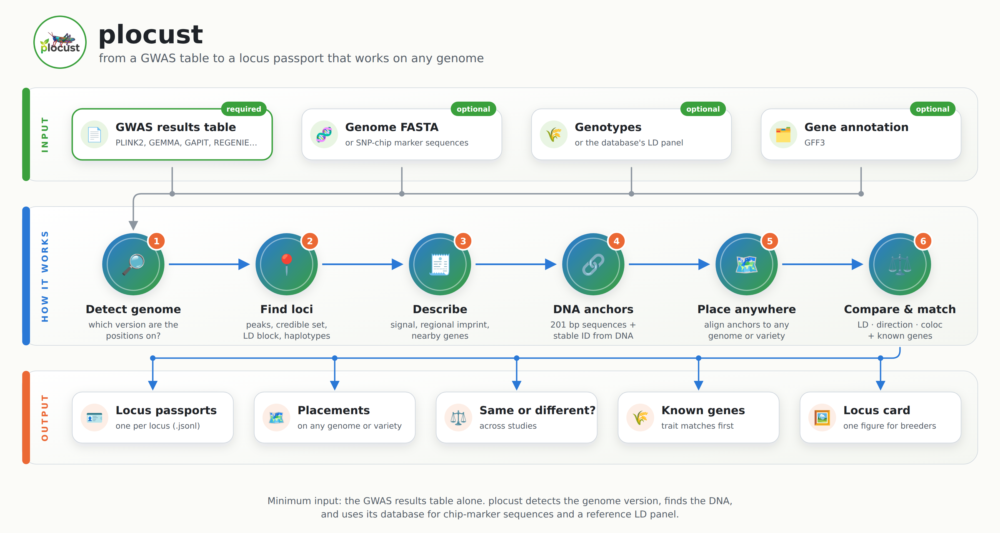
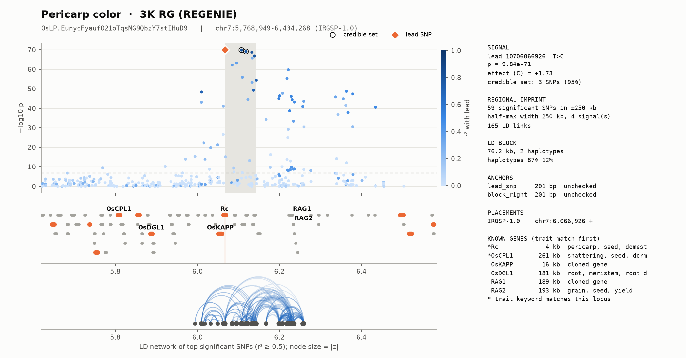

<p align="center">
  
</p>

<h1 align="center">plocust</h1>

<p align="center">
  <b>Every GWAS locus gets a passport.</b><br>
  Recognise the same locus across studies, genome versions and plant varieties,<br>
  using DNA sequence and the GWAS signal instead of fragile coordinates.
</p>

<p align="center">
  
  
  
  
  
</p>

---

## 🌾 The problem

A GWAS locus is usually written down as a **position**: *"chr1 : 38.1 Mb, genome version X"*.
That position breaks easily:

| What happens | What goes wrong |
|---|---|
| 🧬 The genome version changes | the same locus gets a new position |
| 🌱 Another variety's genome is used | positions do not match at all |
| 🔬 Two studies use different SNPs | you cannot tell **one** signal from **two nearby** signals |
| 📄 A breeder has only a results table | no genome file, no genotypes, no way to compare |

So questions every breeder asks become hard:
*"Is my locus the same as the one in that paper?"* · *"Which known gene is behind it?"*

## 💡 The idea

**plocust** describes each locus by **what it is**, not where it was once found:

```
            ┌──────────────────────── LOCUS PASSPORT ─────────────────────────┐
            │  ID          OsLP.EunycFyaufO21oTqsMG9QbzY7stIHuD9  (from DNA)  │
            │  DNA anchors 201 bp around the lead SNP and the block edges     │
            │  Signal      lead SNP, p-value, effect, credible set            │
            │  LD block    length, haplotypes                                 │
            │  Imprint     the surrounding GWAS signal: z-scores, peak shape, │
            │              number of signals, LD network                      │
            │  Genes       nearby genes, known genes with matching traits     │
            │  Placements  where it sits on each genome / variety             │
            └─────────────────────────────────────────────────────────────────┘
```

The ID is computed from the DNA sequence itself, so **it never changes** when the genome version does.
Wherever the anchor sequence is found, the locus is found.

## ⚙️ How it works

<p align="center"></p>

1. **Detect the genome version** from positions and alleles (the right one matches ~100 %, a wrong one ~50 %).
2. **Find loci**: group significant SNPs; credible set, LD block, haplotypes.
3. **Describe** each locus, including a **regional imprint** of the surrounding GWAS signal.
4. **Anchor** it with DNA: from the genome, or from SNP-chip marker sequences when no genome is at hand.
5. **Place** it on any other genome by aligning its anchors.
6. **Compare and match**: same signal or not (LD, effect direction, colocalization), and which known genes are there.
7. **Fine-map**: split each region into its causal signals with credible sets (SuSiE). Studies from different
   subpopulations (e.g. indica and japonica) can be fine-mapped **jointly**, which narrows the credible sets.

## 📥 Input → 📤 Output

<table>
<tr><th>Input</th><th>Output</th></tr>
<tr valign="top"><td>

| | Needed? |
|---|---|
| **GWAS results table**<br>(PLINK2, GEMMA, GAPIT, REGENIE, any CSV/TSV) | ✅ required |
| Genome FASTA of the study | optional |
| Genotypes (PLINK) for LD | optional |
| Gene annotation (GFF) | optional |
| Known-loci database | optional |

**The minimum is the results table.**
The database supplies marker sequences and a reference LD panel.

</td><td>

| | What you get |
|---|---|
| 🪪 **Passports** (`.jsonl`) | one per locus, + a `.tsv` summary |
| 🗺️ **Placements** | the locus on another genome, with warnings |
| ⚖️ **Comparison** | same / opposite effect / different / ambiguous |
| 🧪 **Colocalization** | probability of one shared causal variant |
| 🌾 **Known genes** | genes in the locus, trait matches first |
| 🖼️ **Locus card** | one figure per locus |

</td></tr>
</table>

## 🖼️ The locus card

One picture per locus: the association peak coloured by LD, genes (known genes in orange), the LD network of the
top SNPs, and a summary panel with signal, imprint, anchors, placements and known genes.

<p align="center"></p>

<p align="center"><i>Pericarp colour in 3,000 rice genomes: the card finds <b>Rc</b>, the classic red-pericarp gene, 4 kb from the lead SNP.</i></p>

## 🚀 Quick start

```bash
git clone <repo-url> plocust && cd plocust
python -m venv .venv && . .venv/bin/activate
pip install -e ".[dev]"
pytest                      # 51 tests
```

Python ≥ 3.10. Alignment uses `mappy` (minimap2) and sequence access uses `pysam`, both installed from PyPI.

## 🧭 Commands

```bash
# 0. Which genome version are my coordinates on?
plocust detect-build --sumstats gwas.tsv --genome IRGSP-1.0.fa:IRGSP-1.0 --genome MSU6.fa:MSU6

# 1. GWAS results -> passports
plocust identify --sumstats gwas.tsv --genome IRGSP-1.0.fa --build IRGSP-1.0 \
    --gff IRGSP-1.0.gff3.gz --bfile panel --species "Oryza sativa" \
    --trait "plant height" --study my_gwas --out loci.jsonl

#    no genome file? use chip-marker sequences stored in the database
plocust identify --sumstats old.tsv --db plocust-db-rice.sqlite --build MSU6 \
    --species "Oryza sativa" --trait "plant height" --study old_paper --out old.jsonl

# 2. Place passports on another genome or variety
plocust anchor old.jsonl --genome IRGSP-1.0.fa --build IRGSP-1.0 --out old.irgsp.jsonl

# 3. Fine-map: how many signals, and which variants (SuSiE from summary statistics + LD)
plocust finemap loci.jsonl --sumstats gwas.tsv --bfile panel --covar pcs.tsv --out loci.fm.jsonl

# 4. Compare two studies (LD from your panel, or the database's reference panel)
plocust compare old.irgsp.jsonl loci.jsonl --build IRGSP-1.0 --db plocust-db-rice.sqlite --out pairs.tsv

# 5. Match to known genes
plocust match loci.jsonl --db plocust-db-rice.sqlite --build IRGSP-1.0 --out known.tsv

# 6. Draw a locus card
plocust card loci.jsonl --index 0 --sumstats gwas.tsv --gff IRGSP-1.0.gff3.gz \
    --db plocust-db-rice.sqlite --out locus.png
```

<details>
<summary><b>What the comparison calls mean</b></summary>

| Call | Meaning |
|---|---|
| `same` | the two lead SNPs are in strong LD (r² ≥ 0.5): one signal |
| `same_opposite_effect` | one signal, but the trait-raising alleles differ (e.g. amylose vs waxy rice) |
| `distinct_nearby` | r² < 0.1: two independent signals in the same region |
| `ambiguous` | in between |
| `same_by_position` / `nearby` | no LD panel available: decided by distance only |
| `gene_in_locus` / `gene_nearby` | a known gene inside, or near, the locus |

Each pair also gets: `direction` (concordant / discordant), `profile_corr` (imprint similarity) and
colocalization posteriors `PP.H4` (one shared variant) / `PP.H3` (two variants) with `coloc_call`.

Placement warnings: `missing_anchor`, `multi_mapping`, `split`, `inverted`, `out_of_order`.
</details>

<details>
<summary><b>Python API</b></summary>

```python
from plocust.io import read_sumstats, Genome, Genotypes
from plocust.identify import identify_loci, StudyInfo
from plocust.anchor import Aligner, anchor_passports
from plocust.match import compare

loci = identify_loci(read_sumstats("gwas.tsv"),
                     StudyInfo("Oryza sativa", "plant height", "my_gwas", "IRGSP-1.0"),
                     genome=Genome("IRGSP-1.0.fa"), geno=Genotypes.open("panel"))
anchor_passports(loci, Aligner("MH63RS2.fa", build="MH63RS2"))
```
</details>

## ✅ Does it work? (tested on real rice data)

| Question | Answer | Evidence |
|---|---|---|
| Find a locus on another genome **without coordinates**? | ✅ yes | 98–99 % correct on 5 genomes (MH63, ZS97, N22, Azucena, MSU6); reusing coordinates: 1–2 % |
| Move an **old study** to the current genome? | ✅ yes | 45/45 lead SNPs moved from MSU6 to IRGSP-1.0 at the exact position |
| Work with **no genome file**, only marker names? | ✅ yes | 300/300 chip markers placed exactly, even with 16+16 bp flanks |
| **Detect the genome version** automatically? | ✅ yes | right version 99.9–100 % allele match, wrong ones ~50 % |
| Tell **same** from **different nearby** signals? | ✅ yes | 0/12 nearby signals wrongly merged (interval overlap: 5/12) |
| Match the **same locus in two real studies**? | ✅ yes | *sd1*, *Wx*, *Rc* matched between RDP1 (MSU6) and 3K (IRGSP-1.0) |
| Notice **opposite trait coding**? | ✅ yes | *Wx*: amylose vs waxy endosperm → `same_opposite_effect` |
| Recover **known genes**? | ✅ mostly | *Rc*, *Wx* in both studies; *sd1* in 3K; awn genes not found (weak signal) |
| **Fine-map** loci into signals? | ✅ for counting | 525 clumped loci → 480 signals; over-split traits shrink (e.g. 16 → 6) |
| Pinpoint the **causal variant**? | ⚠️ partly | *sd1* and *GS3* (PIP 0.92 on a SNP inside *GS3*); 3/16 known genes overall; depends on how LD is set |

Full details: [`validation/README.md`](validation/README.md).

## 🌾 The rice atlas

plocust has been run on public rice data: GWAS for **64 traits** (3K and RDP1 panels), **44,354 leaf eQTLs**,
**4,314 cloned genes**, fine-mapping of every locus, and a joint indica/japonica fine-mapping test.
The result is a local passport database of **49,193 records**. Scripts, results and lessons:
[`atlas/README.md`](atlas/README.md).

## ⚠️ Good to know

- **LD must match the study population and its covariates.** LD borrowed from another subpopulation gave
  almost only false signals; raw LD with mixed-model z-scores doubled the number of signals. `plocust finemap
  --covar` adjusts LD for the GWAS covariates, and every region reports its LD outliers.
- **Use a dense LD panel.** With a sparse panel, a missing lead SNP can be replaced by a poor proxy (this made *Rc* look
  "ambiguous" until the dense 3K panel was used).
- **Variant-level fine-mapping is the open problem**: results depend on how LD is adjusted for population
  structure, and in real data joint indica/japonica fine-mapping gained little so far (simulation: credible sets halved).
- **Colocalization is a second opinion**, not a replacement for the LD test: in simulation it did not beat it.
- **Early numbers.** The simulation has few true pairs (24); more runs are planned.
- **Long-range LD** can split one signal into several loci.

## 🗄️ The known-loci database

A separate, versioned SQLite file (not yet released). The rice build holds **4,314 cloned genes** (funRiceGenes)
placed on IRGSP-1.0 and five other genomes, plus SNP-chip markers and a reference LD panel.

```bash
plocust db build-genes --genes geneInfo.table.txt --keywords geneKeyword.table.txt \
    --gff IRGSP-1.0.gff3.gz --genome IRGSP-1.0.fa --build IRGSP-1.0 \
    --assembly MH63RS2.fa:MH63RS2 --species "Oryza sativa" --out plocust-db-rice.sqlite
plocust db add-markers plocust-db-rice.sqlite --markers chip_manifest.tsv --panel "44K array"
plocust db attach-ld   plocust-db-rice.sqlite --bfile 3k_dense --build IRGSP-1.0 --name "3K filtered"
plocust db info        plocust-db-rice.sqlite
```

## 🛣️ Roadmap

- [x] Passport schema, stable sequence-based ID
- [x] Identify · anchor · compare · match · locus card
- [x] Build detection, effect direction, regional imprint, marker lookup, reference LD panel, colocalization
- [x] Validation on real rice data (two rounds)
- [x] Fine-mapping (SuSiE from summary statistics), joint cross-subpopulation model
- [x] Rice atlas: 64 GWAS traits, 44k eQTLs, passport database
- [ ] Tissue-matched expression data for gene prioritisation
- [ ] Release the rice database (with a dense LD panel)
- [ ] More crops (wheat, maize, sorghum, barley)
- [ ] Publish on PyPI as `plocust`

## 📚 More

- [`validation/README.md`](validation/README.md): all validation results
- [`schema/passport.schema.json`](schema/passport.schema.json): the passport format (JSON Schema)

<sub>Licence: not chosen yet. Logo: generated with Google Gemini.</sub>
